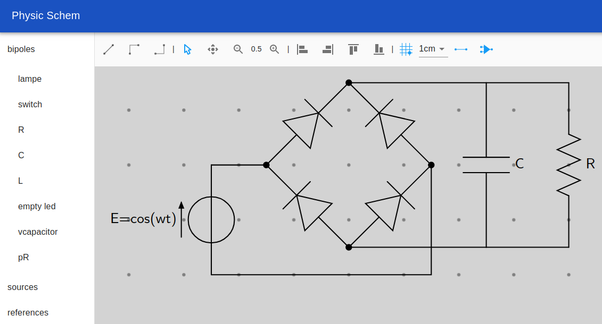
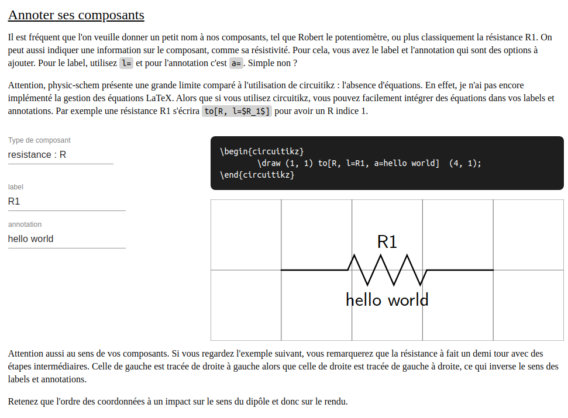
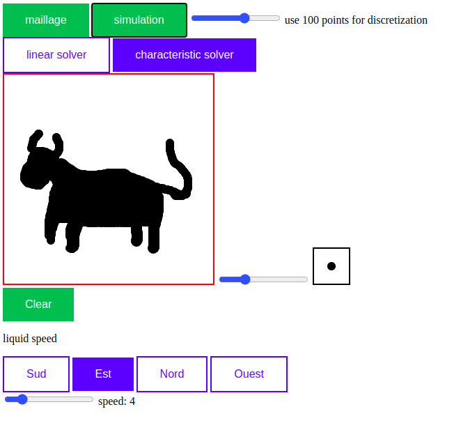
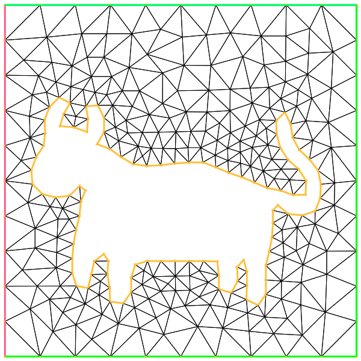
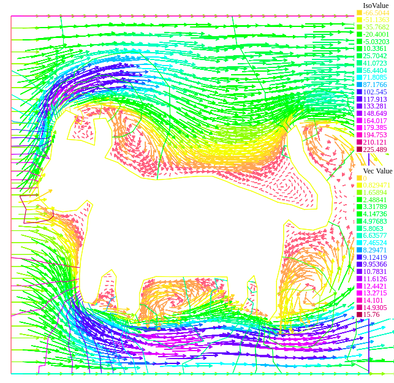

### Hi there 👋

I'm Alexandre, and I'm glad to present you my side projects :smiley_cat:

## [physic-schem](https://alexfauquette.github.io/physic-shem/)

This web app allows you to draw simple electric schemas, and export them as png or [circuitikz](https://github.com/circuitikz/circuitikz) code that can directly be copy past in your LaTeX document. It comes with an introduction on how to use circuitikz.

This project is made with ReactJS, Redux, Material-UI, and some other lovely libraries. The documentation is not ready yet, but please do not hesitate to contact me if you have any question or comment.

  
   

## [joke-simulation](https://https://alexfauquette.github.io/joke-simulation/)

The small one, allows you to perform simulations on fluid dynamics directly in your web browser. This project relies on [FreeFem++-js](https://www.ljll.math.upmc.fr/lehyaric/ffjs/), a Javascript version of [FreeFem++](https://freefem.org/). The FreeFem++ code is provided by [Thomas Rey](https://thomasrey.wordpress.com/).

  
   
  

## [OpenFoodFact HungerGames](https://github.com/openfoodfacts/openfoodfacts-hungergames)

OpenFoodFact maintain a collaborative and open database of food products (the Wikipedia of food). Extracting informations from food packaging is a boring task. So we try to provide a better user experience.

# Professional

Briefly, I studied Electrical engineering and machine learning at (Supélec)[https://www.centralesupelec.fr/], and at the (ENS-Paris-Saclay)[http://math.ens-paris-saclay.fr/version-francaise/formations/master-mva/].

I worked in laboratories on probabilities and graphs ((LRI)[https://www.lri.fr/equipe.php?eq=26], (KTH)[https://people.kth.se/~alepro/], (EPFL)[https://indy.epfl.ch/]). And in a startup for web development (Theodo)[https://www.theodo.fr/theodo].

# Contact :mailbox_with_mail:

- :bird: [Twitter](https://twitter.com/AleFauquette)
- :necktie: [LinkedIn](https://www.linkedin.com/in/alexandre-fauquette/)
- :mailbox_with_mail: alex dot fauquette at gmail dot com

<!--
**alexfauquette/alexfauquette** is a ✨ _special_ ✨ repository because its `README.md` (this file) appears on your GitHub profile.

Here are some ideas to get you started:

- 🔭 I’m currently working on ...
- 🌱 I’m currently learning ...
- 👯 I’m looking to collaborate on ...
- 🤔 I’m looking for help with ...
- 💬 Ask me about ...
- 📫 How to reach me: ...
- 😄 Pronouns: ...
- ⚡ Fun fact: ...
  -->
